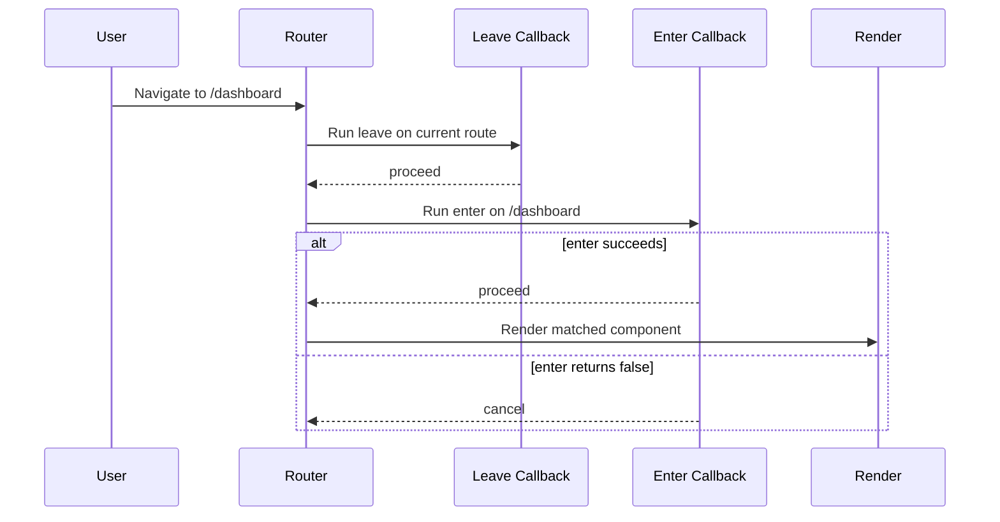

## Lifecycle Order

When navigating from one route to another (e.g., `/editor/1` to `/dashboard`), the router processes hooks in a specific order:

1. **Leave** of current route fires (deepest child → ancestors).
2. **Enter** of target route fires.
3. If any callback returns `false`, navigation is cancelled.
4. If all callbacks pass, the new route renders and window history updates.

## `goto` vs `navigate`

While both resolve a pathname and activate a route, their impact on the browser differs:
- **`navigate()`**: Triggers `history.pushState` and updates the URL bar. Used for user-facing navigation.
- **`goto()`**: Does **not** touch the URL bar. Used internally for redirects inside `enter` callbacks, ensuring the browser history isn't polluted with aborted routes.
