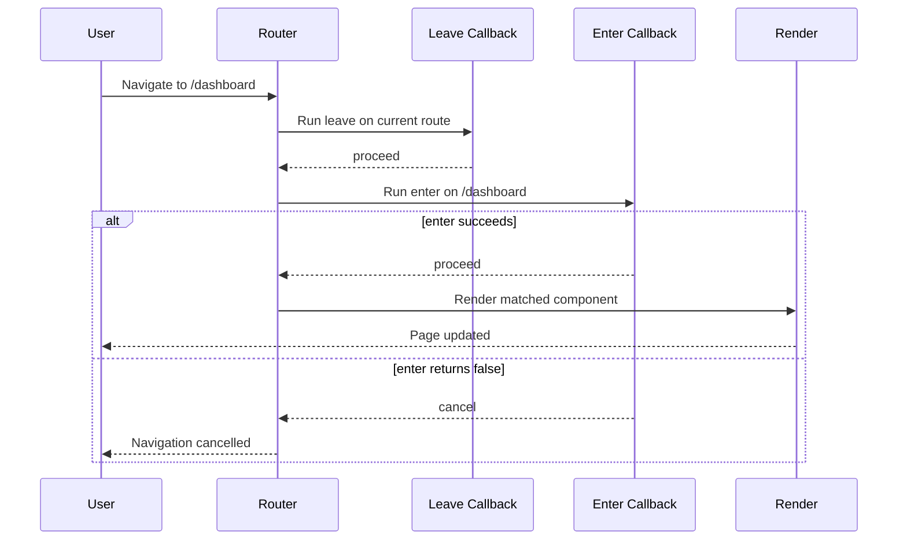

## Lifecycle

Every route can declare `enter` and `leave`. Both receive the current route context and an `AbortSignal`. They run sequentially — the next callback waits for the previous one to resolve.

- **`enter`** — Runs before the route becomes active. Use it to fetch data, check permissions, or run side effects.
- **`leave`** — Runs before navigating away. Use it for cleanup, unsaved-changes prompts, or analytics.

Return `false` from either callback to cancel the navigation. The URL does not change, the current route stays active. Any other return value allows the navigation to proceed.

### Enter Callback

```typescript
import Router from 'lit-router';

class App extends LitElement {
  _router = new Router(this, [
    {
      path: '/dashboard',
      enter: () => {
        if (!isLoggedIn()) return false;
      },
      render: () => html`<dashboard-page></dashboard-page>`,
    },
    {
      path: '/reports/:id',
      enter: async ({ params, signal }) => {
        const response = await fetch(`/api/reports/${params.id}`, { signal });
        if (!response.ok) return false;
        this._report = await response.json();
      },
      render: ({ params }) => html`
        <report-page id=${params.id} .data=${this._report}></report-page>`,
    },
  ]);
}
```

The `enter` callback signature:

```typescript
enter: (context: {
  params: Record<string, string>, // URL path parameters matched by next route
  extraParams: Record<string, any>, // accumulated data from upstream callers (set via `navigate()` or `push()` options)
  searchParams: Record<string, string>,  // next route URL query string
  hash: string, // URL hash fragment (without `#`)
  signal: AbortSignal, // An abortsignal that can abort the navegation
  pathname: string, // next pathname
  route: Route, // the matched `Route` instance
}) => Promise<boolean | void> | boolean | void
```

- `signal` is aborted if a new navigation supersedes the current one (e.g. rapid clicks) or the host disconnects from the DOM
- Use `signal` to cancel in-flight fetches, timers, or subscriptions

### Leave Callback

```typescript
{
  path: '/editor/:id',
  leave: async ({ params }) => {
    if (this._hasUnsavedChanges) {
      return confirm('Discard changes?');
    }
  },
  render: () => html`<editor-page></editor-page>`,
}
```

The `leave` callback signature:

```typescript
leave: (context: {
  params: Record<string, string>, // URL path parameters matched by current route
  extraParams: Record<string, any>, // accumulated data from upstream callers (set via `navigate()` or `push()` options)
  searchParams: Record<string, string>, // URL query string
  hash: string, // URL hash fragment (without `#`)
  signal: AbortSignal, // An abortsignal that can abort the navegation
}) => Promise<boolean | void> | boolean | void
```

Leave callbacks fire top-down — deepest evaluation. If any returns `false`, the navigation is cancelled and no further leave callbacks run.

### Render Callback

The `render` callback fires after `enter` succeeds. It receives the merged route context and returns a Lit `TemplateResult`.

**render signature:**
```typescript
render: (context: {
  params: Record<string, string>, // URL path parameters matched by this route
  extraParams: Record<string, any>, // accumulated data from upstream callers (set via `navigate()` or `push()` options)
  searchParams: Record<string, string>, // current URL query string
  hash: string, // URL hash fragment (without `#`)
  route: Route, // the `Route` instance itself
}) => TemplateResult | nothing | null
```

### Navigation Order

When navigating from `/editor/1` to `/dashboard`:

1. **Leave** of `/editor/:id` fires (deepest child → ancestors)
2. **Enter** of `/dashboard` fires
3. If any callback returns `false`, navigation is cancelled and the URL does not change
4. If all callbacks pass, the new route renders and window history is updated



> **Note:** Leave callbacks are skipped during browser-initiated navigation (popstate, initial load) — the browser already navigated away. The skip also applies on the fast-path when the same route is matched with the same params.
